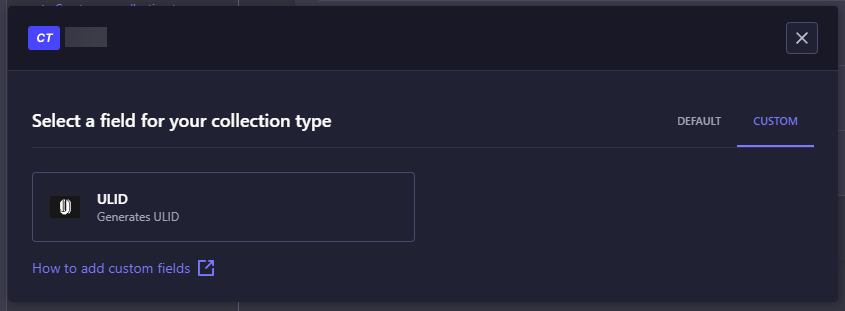

# Strapi Plugin - ULID

 [](LICENSE)

This plugin adds support for ULID field type to Strapi as a Custom field. The field will be automatically generated when creating a new entry.

This plugin is inspired and based on [strapi-auto-uuid](https://github.com/Cringe-Studio/strapi-auto-uuid) by [Cringe Studio](https://github.com/Cringe-Studio). All credits go to them.

<!-- ## 🗝️ Features

- [x] xx -->

## 🚀 Getting Started

1. Install the plugin by running:

   ```bash
   npm install strapi-ulid
   ```

2. Rebuild admin panel:

   ```bash
   npm run build
   ```

## 📝 Usage

Add the custom field from the admin panel:


or

Add the following to your content-type schema:

```javascript
{
  // ....
  attributes: {
    // ....
    ulid: {
      type: "customField",
      customField: "plugin::field-ulid.ulid",
    },
    // ....
  },
  // ....
}
```

## 📝 License

This project is licensed under the MIT License - see the [LICENSE](LICENSE) file for details
